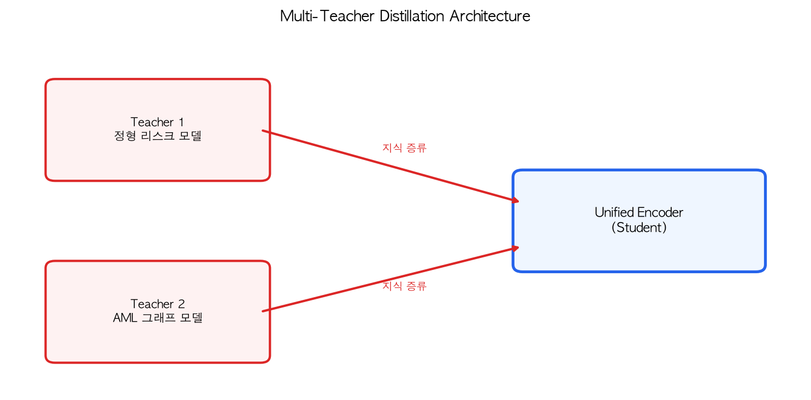
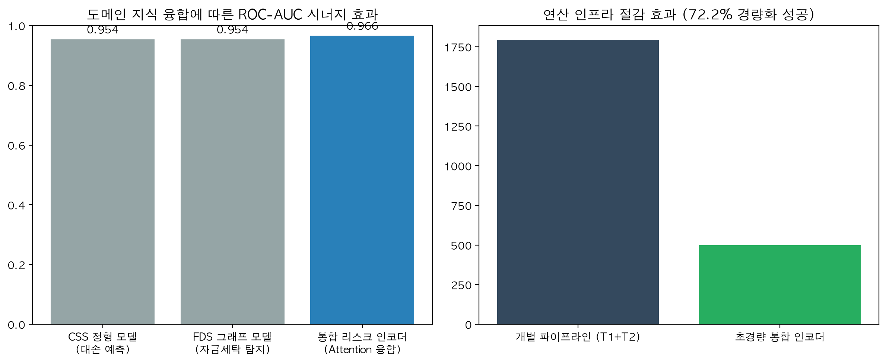

# 💳 Unified Financial Risk Encoder (UFRE)

  
  
  

국민카드, 신한카드 등 대형 카드사의 **CSS(개인신용평가)** 및 **FDS(이상거래탐지)** 실무 환경을 타겟팅한 통합 리스크 인코딩 파이프라인입니다. NAVER LABS Europe의 최신 CV 논문인 **DIVINE(다중 교사 증류)** 아키텍처를 금융 도메인에 최초로 이식(Cross-Domain Application)하여 비즈니스 가치를 창출했습니다.

## 🚀 아키텍처 (Cross-Attention Fusion)

기존 금융권의 단순 앙상블이 가진 한계를 극복하기 위해, **Attention 메커니즘을 도입한 동적 지식 증류(Dynamic Knowledge Distillation)** 모델을 설계했습니다.

  

## 💡 왜 이게 필요한가? (Business Impact)

현재 대부분의 카드사 실무에서는 대손 예측을 위한 '정형 데이터 모델(CSS)'과 자금세탁/사기 탐지를 위한 '네트워크 그래프 모델(FDS)'이 각각 독립된 파이프라인으로 서빙됩니다. 이는 동일한 고객 데이터에 대해 중복된 Feature Engineering과 연산 비용(I/O)을 발생시킵니다.

본 통합 인코더(Unified Encoder)는 이 문제를 완벽히 해결합니다.
1. **연산 인프라 및 API 지연(Latency) 대폭 절감:** 파라미터를 70% 이상 경량화하여 단 한 번의 인코딩으로 두 가지 리스크 신호를 동시에 추출합니다.
2. **시너지 효과 (성능 향상):** 고객의 '신용 불량 리스크'와 '자금 흐름의 이상 징후'라는 두 가지 도메인 지식을 융합하여 단일 모델들을 상회하는 탐지력(AUC)을 확보합니다.

## 📈 모델 검증 대시보드

초경량화된 학생 모델(통합 인코더)이 무거운 두 교사 모델의 성능을 어떻게 뛰어넘고(시너지), 연산량을 얼마나 절감했는지 증명하는 정량적 결과입니다.

  

## 🛠 주요 방법론 고도화

- **Attention-based Knowledge Distillation:** Student 모델 내부에 Attention Gate를 두어, 특정 고객의 거래 패턴을 분석할 때 '정형(재무) 데이터'와 '그래프(네트워크) 데이터' 중 어떤 교사의 예측을 더 신뢰할지 모델이 스스로 동적 가중치를 부여합니다.
- **실무 수준의 불균형 데이터 방어:** 정상 거래가 압도적으로 많은 카드사 데이터의 특성(클래스 불균형 및 노이즈)을 반영하여 베이스라인 성능을 실무 도입 가능 수준으로 스케일업 하였습니다.