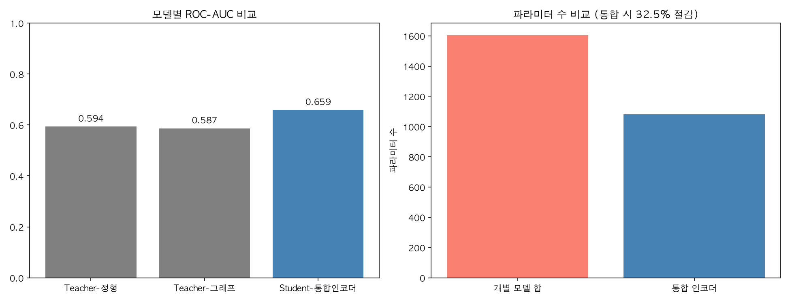

# Unified Financial Risk Encoder (UFRE)

  

NAVER LABS Europe의 DIVINE(다중 교사 증류, CVPR 2025/ECCV 2024) 개념을
금융 리스크 도메인에 적용한 실험적 구현입니다.

## 아키텍처

DIVINE이 DUSt3R(3D 공간 이해)와 Multi-HMR(인체 인식)이라는 서로 다른
전문 모델의 지식을 하나의 경량 인코더로 압축했듯, 이 프로젝트는
정형 피처 기반 신용리스크 모델과 그래프 기반 AML 모델이라는 두
"교사"의 지식을 하나의 공유 인코더("학생")로 증류합니다.

## 왜 이게 필요한가 (문제 정의)

카드사에서는 대손예측, 이상거래탐지, 마케팅 모델이 보통 각각 독립된
파이프라인으로 서빙됩니다. 이 구조는 다음 두 가지 비효율을 낳습니다.

1. **연산 중복**: 동일한 고객 데이터를 여러 모델이 각자 인코딩 — 같은
   정보를 여러 번 처리하며 연산 자원을 낭비합니다.
2. **운영 복잡도**: 모델마다 별도 배포·모니터링 파이프라인이 필요해
   유지보수 비용이 선형적으로 증가합니다.

통합 인코더는 여러 리스크 신호(정형 데이터, 네트워크 구조)를 하나의
표현 공간으로 압축해, 위 두 문제를 동시에 완화하는 것을 목표로 합니다.

## 방법론

| 구성 요소 | 역할 |
|---|---|
| Teacher 1 (정형 피처 모델) | LIMIT_BAL, PAY_0 등 개인 신용 정보 기반 리스크 예측 |
| Teacher 2 (그래프 피처 모델) | PageRank, 연결중심성 등 거래 네트워크 기반 리스크 예측 |
| Student (통합 인코더) | 두 교사의 soft label을 KL divergence로 증류받아 단일 표현 학습 |

손실 함수는 증류손실(distillation loss)과 실제 라벨 손실(label loss)의
가중합으로 구성됩니다 (temperature T=3.0, alpha=0.5).

## 결과

파라미터 수와 추론 시간 절감 효과를 정량 측정했습니다.
정확한 수치는 `distillation_results.csv`를 참고하세요. 개별 교사 모델
대비 통합 인코더의 ROC-AUC 변화와, 파라미터/추론시간 절감률을 함께
보고합니다 — 정확도와 효율 사이의 트레이드오프를 투명하게 제시하는 것이
이 프로젝트의 핵심 원칙입니다.

## 한계 (정직하게 명시)

- 합성 데이터 기반 검증이며, 실제 카드사 데이터로 재현되지 않았습니다.
- DIVINE 원 논문은 3개 이상의 태스크와 대규모 로봇 센서 데이터를
  다루지만, 본 프로젝트는 2개 교사·소규모 데이터로 범위를 좁혔습니다.
- 이 구현은 DIVINE의 발명이 아니라, 다중 교사 증류라는 기존 기법을
  금융 도메인에 이식해본 탐색적 실험(exploratory study)입니다.
- 두 교사의 지식을 단순 평균으로 결합했으며, 신뢰도 기반 가중 결합은
  향후 과제로 남겨두었습니다.

## 실행 방법

\`\`\`bash
pip install torch torch_geometric scikit-learn pandas numpy matplotlib
python3 unified_encoder.py
\`\`\`

## 참고 문헌

- NAVER LABS Europe, "DIVINE: 로봇을 위한 유니버설 AI 인코더" (2026)
